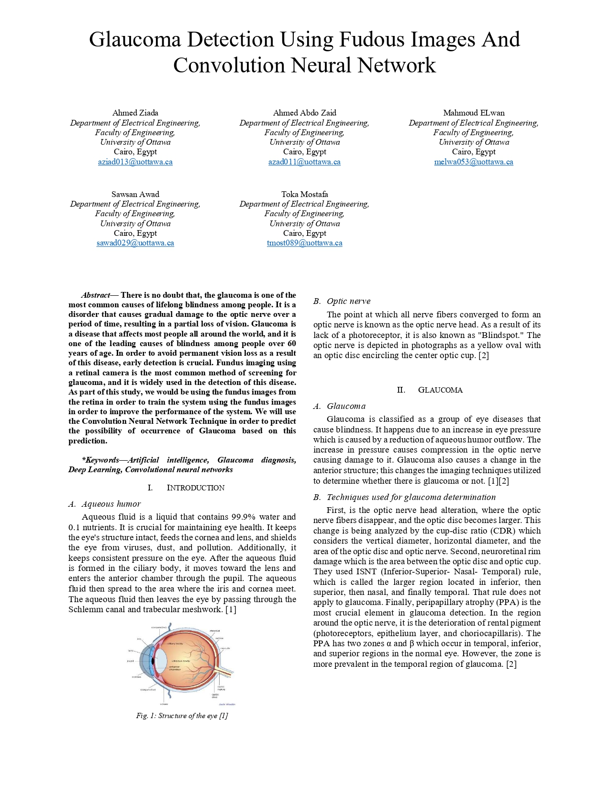
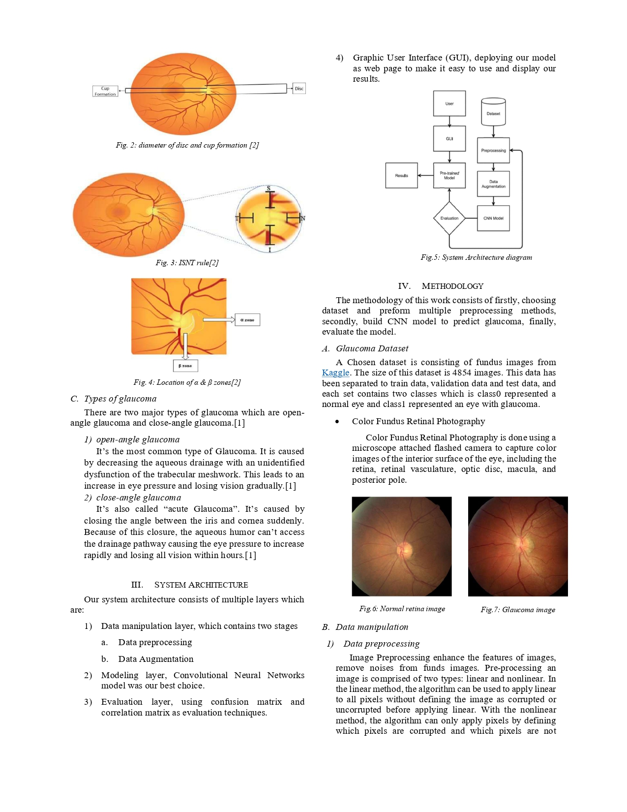
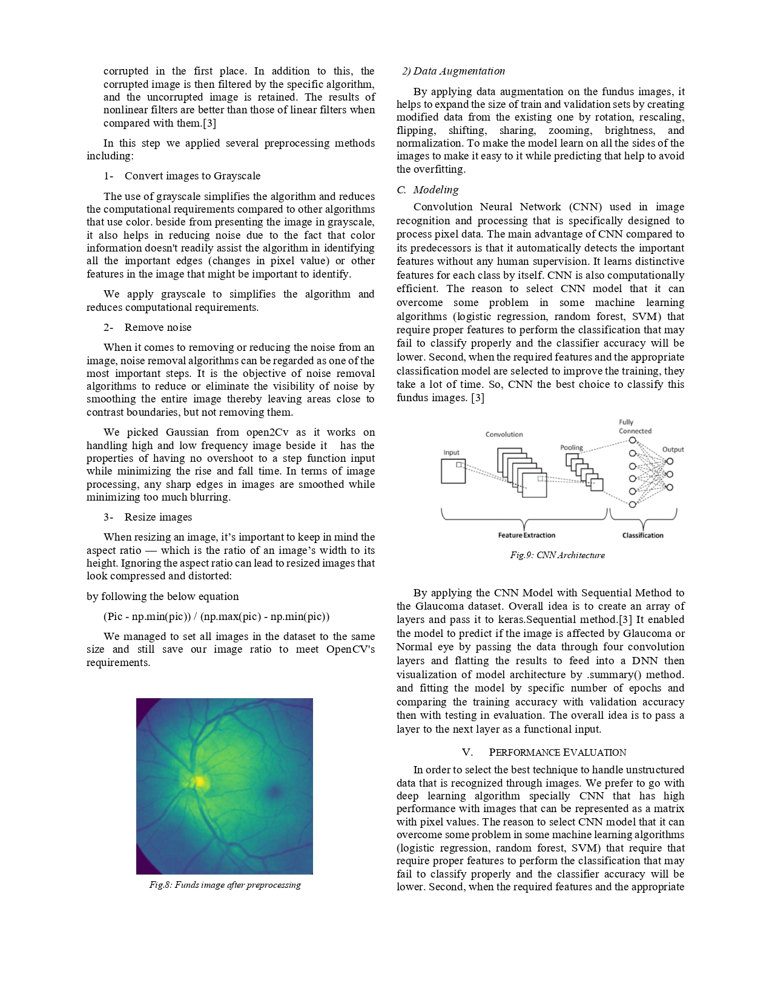

# Glaucoma Detection Using Fudous Images And Convolution Neural Network

## Problem Definition
There is no doubt that, the glaucoma is one of the most common causes of lifelong blindness among people. It is a disorder that causes gradual damage to the optic nerve over a period of time, resulting in a partial loss of vision. Glaucoma is
a disease that affects most people all around the world, and it is one of the leading causes of blindness among people over 60 years of age. In order to avoid permanent vision loss as a result of this disease, early detection is crucial.

